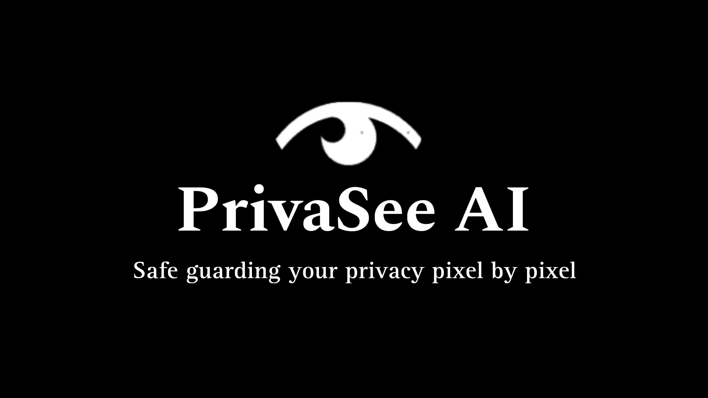

# PrivaSee-AI

At SheHacks+ 8 my team and I built PrivaSee AI, a tool that will help social media users feel safe when posting images and videos online. PrivaSee scans the background of images and videos and points out potential private information leaks such as room/house numbers, computer/phone screens and logos. With this tool, social media users can ensure they are not leaking any information that could potentially put their safety in danger. 

We used Roboflow to build our own dataset to train our AI tool, using this we used the image detection tools on YOLOv8 to implement the detection in our project. Finally, we used an HTML, CSS and javascript template to build our website which was supposed to embed the tool. However with the time constraints of the hackathon and large file sizes we could not put the tool on the web.

Our team was able to secure 2nd place overall at SheHacks+, win the MLH prize for best domain name and even got an honourable mention from GM!

Check out our [Devpost]([https://www.google.com](https://devpost.com/software/privasee-ai])

